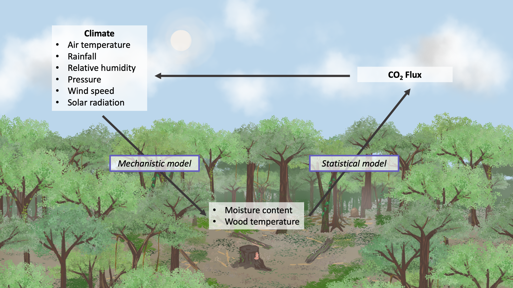

# WTF-Climate-Flux
This repository contains the code for the publication "Climate-based prediction of carbon fluxes from deadwood in Australia." The preprint is available on EGUsphere: https://doi.org/10.5194/egusphere-2023-1952.

## Project Description
This projects aims to predict carbon dioxide fluxes from tropical deadwood using wood moisture content and temperature. Using climate data, we simulated wood moisture content and temperature with a mechanistic fuel moisture content model. Then, we developed a Bayseian statistical relationship between wood moisture content and temperature and carbon dioxide flux to predict flux rates at a 1-hour temporal resolution across a 4-year time period. We validated our simulations by estimating cumulative carbon fluxes and comparing them to measuring mass loss from wood blocks.

*Figure 1. Conceptual model of interactions between wood microclimate (defined as wood moisture content and temperature) and CO2 fluxes from decaying wood. Weather variables influence wood microclimate variables, which in turn influences deadwood degradation and the release of CO2 back to the atmosphere. Finally, altered CO2 concentration in the atmosphere affects local and regional climate, influencing future climate patterns. In this study, we used a mechanistic model to derive wood microclimate variables from weather data and a statistical model to relate wood microclimate variables to CO2 flux.*
## Repository items
**Folders**
1. FMC_mechanistic_model: Contains the code and outputs from the mechanistic fuel moisture content model.
2. bayesian_model: Contains the outputs of the Bayesian statistical model.
3. figures: Contains figures included in the manuscript.
4. weather_flux: Contains the code and outputs for retrieving weather data and processing flux data.
**Scripts**
1. figures.R: Contains the script for generating figures.
2.  flux_BM.R: Contains the script for developing the Bayesian statistical model.
